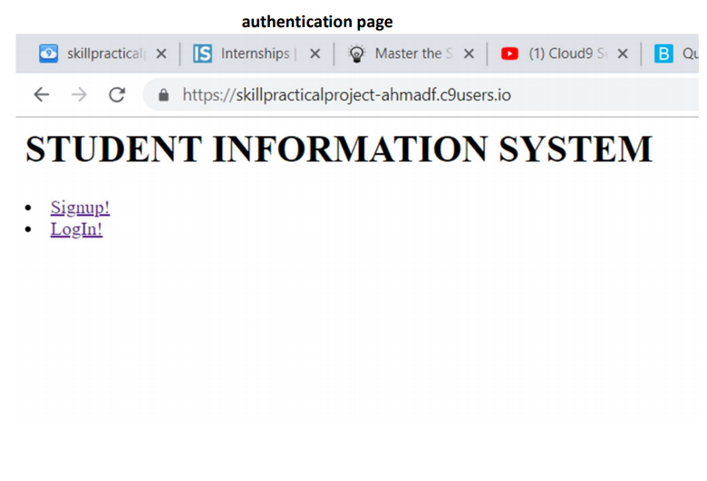
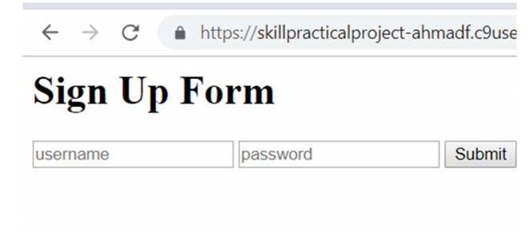
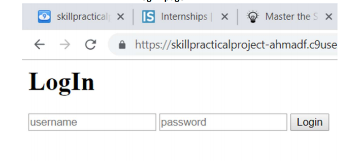
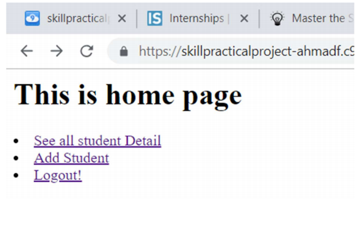
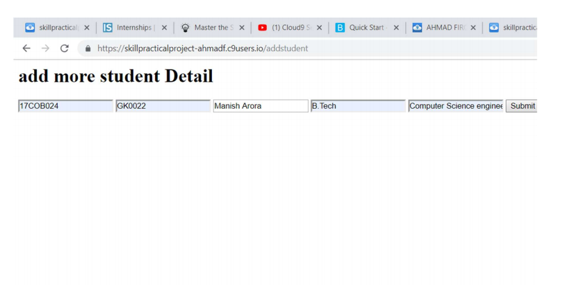
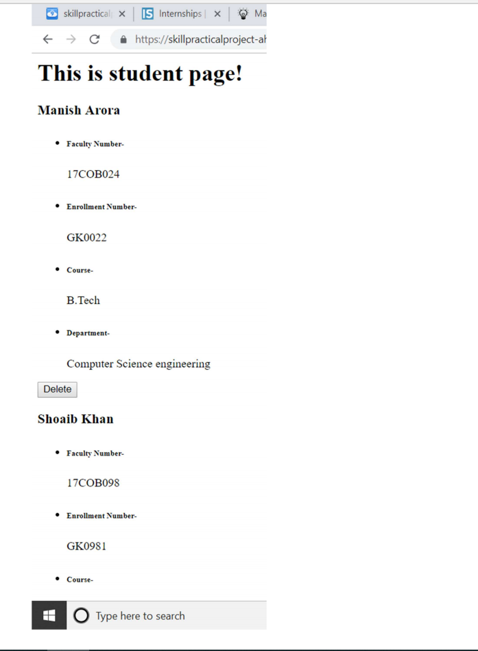

# Student-Management-System
#Project Description:
The scope of STUDENT INFORMATON DETAILS is to develop a
web application that will store students information like Name, faculty number,department,
etc. It will allow administrator to login and see details of all students, add new student detail
and delete any student profile from this web application.

